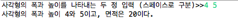
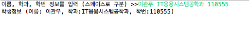
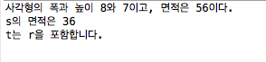

# 클래스와 객체 (실습)

<a name="1"></a>
### 1.	클래스 정의 연습
1. 아래와 같은 멤버를 가지고 있는 Rectangle 클래스를 정의하라.
	- 필드
		- width: 사각형의 폭을 나타내는 int 변수
		- height: 사각형의 높이를 나타내는 int 변수 
	- 메소드 
		- getArea(): 사각형의 면적값을 계산하여 반환하는 메소드
		- print(): Rectangle 객체의 정보(폭, 높이, 면적)를 출력하는 메소드. 면적 정보는 getArea() 메소드를 통해 받아온다.  
2. main()함수에서 다음을 수행하는 코드를 작성하시오.
	- 사각형의 폭과 넓이를 입력받아 2개의 Rectangle 객체를 생성하고, 생성된 Rectangle 객체의 정보(폭, 높이, 면적)를 출력한다.

- 실행결과

	

<a name="2"></a>	
### 2. 클래스 정의 및 생성자 연습
- 이름(name), 학과(department), 학번(id) 필드, 생성자 및 필요한 메소드를 가진 Student 클래스를 작성하고, 다음 실행 사례와 같이 작동하도록 main()을 가진 StudentTest 클래스를 작성하라. 

- 실행결과

	

<a name="3"></a>	
### 3. 생성자 및 메소드의 객체인자 전달 연습
- 다음 멤버를 가지고 직사각형을 표현하는 Rectangle 클래스를 정의하라.
	- int 타입의 x, y, width, height 필드: 사각형을 구성하는 점과 크기 정보
	- Rectangle(x,y,w,h) 생성자
		- x,y,w,h 파라미터를 바탕으로 필드를 초기화한다.
		- w, h 파라미터가 음수인 경우에는 오류메시지를 출력하고 적절한 양수 값으로 초기화 한다.
	- int getArea(): 사각형의 면적값을 반환하는 메소드
	- void print(): 사각형의 좌표와 넓이를 화면에 출력하는 메소드
	- boolean contains(Rectangle r): 매개변수로 받은 r이 현재 사각형 안에 있으면 true를 리턴
- Rectangle 클래스를 테스트하기 위한 main 함수가 있는 RectangleTest 클래스는 다음과 같다.

	```java
	
	public class RectangleTest {
		public static void main(String[] args) {
			Rectangle r = new Rectangle(2,2,8,7);
			Rectangle s = new Rectangle(5,5,6,6);
			Rectangle t = new Rectangle(1,1,10,10);
			
			r.print();
			System.out.println("s의 면적은 "+s.getArea());
			if (t.contains(r)) System.out.println("t는 r을 포함합니다.");
			if (t.contains(s)) System.out.println("t는 s을 포함합니다.");
		}
	}
	
	```

- 실행결과

	  