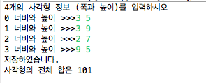
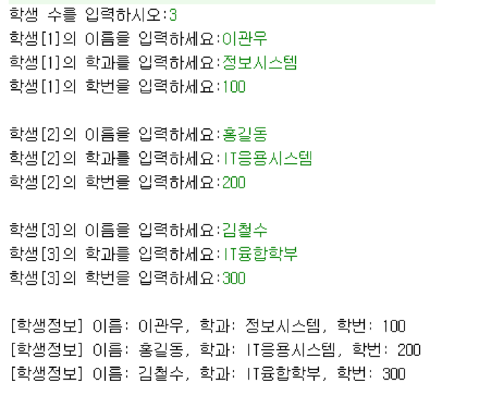
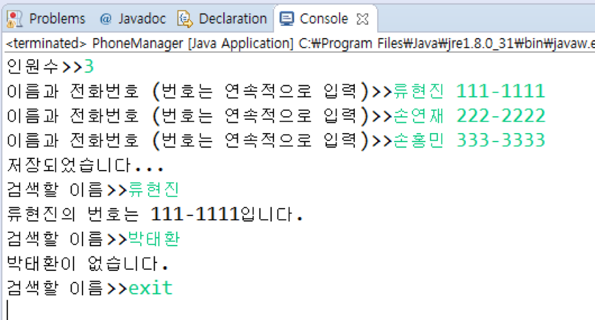

# 클래스와 객체 II (실습)


<a name="1"></a>	
### 1. 객체 배열 연습
- 사각형을 표현하는 다음 Rect 클래스를 활용하여, Rect 객체 배열을 생성하고, 사용자로부터 4개의 사각형 정보(너비와 높이)를 입력받아 배열에 저장한 뒤, 배열을 검색하여 사각형 면적의 합을 출력하는 main() 메소드를 가진 RectArray 클래스를 작성하라.

```java
public class Rect {
	private int width, height;
	public Rect(int width, int height) {
		this.width = width;
		this.height = height;
	}
	
	public int getArea() { return width*height; }
}
``` 

- 실행결과

	

<a name="2"></a>
### 2.	객체 배열 연습 2
1. 다음은 키보드로부터 학생수를 입력 받고, 입력 받은 학생수 만큼의 학생에 대한 정보 (이름, 학과, 학번)를 Student 객체 배열에 저장하고, Student 객체 배열의 모든 저장된 내용을 출력하는 프로그램을 작성하라

- 실행결과

	


<a name="3"></a>	
### 3. 객체 배열 및 캡슐화 연습1 
- 이름(name 필드)과 전화번호(tel 필드)를 가진 **Phone** 클래스를 정의하시오.
	- 필드는 private 멤버로 정의하고, 적절한 생성자와 private 멤버를 접근하기 위한 getter/setter 메소드를 정의하시오.
- 다음과 같은 멤버를 가지고 Phone 객체를 관리하는 **PhoneManager** 클래스를 정의하시오.
	- **phoneArray**: Phone 객체 배열 변수 (private 멤버 변수)
	- **count**: phoneArray 배열에 저장된 Phone 객체의 수를 저장하는 int 형 변수 (private 멤버 변수) 
	- **생성자**: 객체 배열 생성 및 멤버변수 초기화
	- **public void add(Phone phone)**: 매개변수로 주어진 phone 객체를 *phoneArray* 배열에 저장
	- **public Phone searchByName(String name)**: *phoneArray* 배열에 저장된 Phone 객체들 중에 멤버 변수 name의 값이 매개변수 name과 동일한 Phone 객체를 반환  
- 다음 실행 사례와 같이 작동하도록 main()을 가진 PhoneManagerTest 클래스를 작성하라. 한 사람의 전화번호는 하나의 Phone 객체로 다룬다.

- 실행결과

	
	
<a name="4"></a>	
### 4. 객체 배열 및 캡슐화 연습2 
- 다음과 같은 멤버를 가지는 직사각형을 표현하는 **Rectangle** 클래스를 작성하라.
	- int 타입의 **x, y, width, height** 필드: 사각형의 기준점과 너비와 높이를 나타냄
	- 필드는 private 멤버로 정의하고, 적절한 생성자와 private 멤버를 접근하기 위한 getter/setter 메소드를 정의하시오.
	- **public String toString()** : 	
		- x, y, width, height 값을 문자열로 만들어 반환하는 메소드
	- **public boolean equals(Rectangle r)**: 
		- 파라미터로 전달된 객체 r과 현재 객체가 동일한 사각형이면 true를 반환 그렇지 않으면 false를 반환 

- 다음과 같은 멤버를 가지는 **FigureEditor** 클래스를 작성하라.
	- Rectangle 배열 타입의 **rectangles** 필드: 
		- FigureEditor 클래스에 추가된 Rectangle 객체를 저장
	- int 타입의 **numOfRect** 필드:
		- Rectangle 배열에 저장된 Rectangle 객체의 수
	- **public void add(Rectangle r)**: 
		- 파라미터로 입력된 Rectangle 객체 r를 멤버변수로 선언된 Rectangle 배열에 추가; 
		- 파라미터로 입력된 Rectangle 객체 r과 동일한 사각형이 이미 Rectangle 배열에 있으면 추가하지 않음
	- **public void display()**: 
		- Rectangle 배열에서 저장된 모든 Rectangle 객체를 화면에 출력

