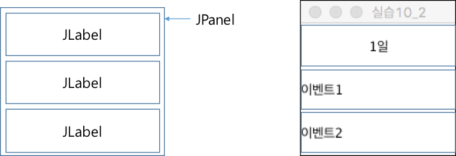
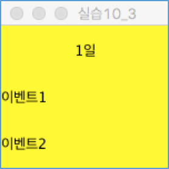
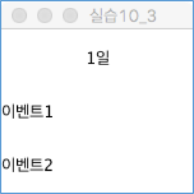
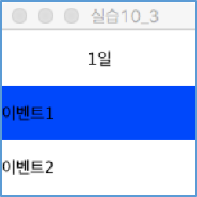
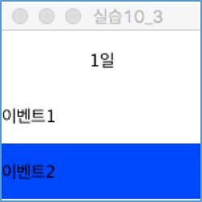

# 자바 GUI 기초 (실습)

---
<a name="1"></a>	
### 1. DayPanel 정의
- 3행1열 GridLayout을 배치관리자로 설정한 JPanel 컨테이너 정의
- 아래 그림과 같이 3개의 JLabel 컴포넌트를 JPanel 컨테이너에 추가
- JLabel 컴포넌트의 문자열의 위치를 설정하는 방법은 JLabel 컴포넌트 생성 시에 설정할 수 있다.
	- JLabel(String text, int horizontalAlignment)
	- 예제

		```java
		JLable label1 = new JLabel("1일", SwingConstants.CENTER);
		JLable label2 = new JLabel("이벤트1", SwingConstants.LEFT);
		```

- 위에서 정의한 JPanel을 150* 150 크기의 JFrame의 컨텐츠 팬으로 설정하여 화면에 표시 (아래 오른쪽 그림과 같은 결과).

	

---
<a name="2"></a>
### 2. JPanel 컨테이너에 Mouse 리스너 추가
- JPanel 컨테이너 위로 마우스 포인터가 들어오면 JPanel 컨테이너의 배경색을 노란색 (Color.Yellow)로 변경하고 마우스 포인터가 JPanel 컨테이너 범위 밖으로 빠져나가면 흰색으로 변경한다.

	
	
 
 
- [참조코드]
https://github.com/kwanulee/JavaExample/blob/master/JavaEvent/MouseEventAllEx/src/MouseEventAllExFrame.java#L14
https://github.com/kwanulee/JavaExample/blob/master/JavaEvent/MouseEventAllEx/src/MouseEventAllExFrame.java#L39-L45

---
<a name="3"></a>	
### 3. JLabel 컴포넌트에 Mouse 리스너 추가
- JLabel 컴포넌트 위로 마우스 포인터가 들어오면 JLabel 컴포넌트의 배경색을 파란색으로 변경하고, 마우스 포인터가 JLabel 컴포넌트 범위 밖으로 나가면 배경색을 흰색으로 변경한다.
	- JLabel 컴포넌트는 불투명도가 false로 초기 설정되어 있으므로, 배경색을 바꾸려면 불투명도를 true로 변경해 줘야 한다.
		
		```java
		JLabel label = new JLabel (“HellO”);
		label.setOpaque(true);
		```
		
	
	

- [참조코드]
https://github.com/kwanulee/JavaExample/blob/master/JavaEvent/MouseKeyEventEx/src/MouseKeyEventEx.java#L39-L52
https://github.com/kwanulee/JavaExample/blob/master/JavaEvent/MouseKeyEventEx/src/MouseKeyEventEx.java#L33

---
<a name="4"></a>	
### 4. JPanel 컨테이너에 JLabel 컴포넌트 동적추가 
- 1,2 번에서는 “이벤트1” 과 “이벤트2”의 문자열을 갖는 JLabel 컴포넌트가 초기에 JPanel 컨테이너에 추가된 상태였다.
- JPanel 컨테이너 안에서 마우스를 누르면 “이벤트” 문자열을 갖는 JLabel 컴포넌트를 JPanel 컨테이너에 추가하도록 하여라.
	- 단, 최대 2개의 JLabel 컴포넌트만 JPanel 컨테이너에 추가할 수 있다.
- 추가된 JLabel 컴포넌트 위로 마우스 포인터가 들어오면 JLabel 컴포넌트의 배경색을 파란색으로 변경하고, 마우스 포인터가 JLabel 컴포넌트 범위 밖으로 나가면 배경색을 흰색으로 변경한다. 

- [참조코드]
https://github.com/kwanulee/JavaExample/blob/master/JavaEvent/MouseKeyEventEx/src/MouseKeyEventEx.java#L24
https://github.com/kwanulee/JavaExample/blob/master/JavaEvent/MouseKeyEventEx/src/MouseKeyEventEx.java#L27-L37

---
<a name="5"></a>	
### 5. JLABEL 컴포넌트에 Key 리스너 추가 
- JLabel 컴포넌트 위로 마우스 포인터가 올라가 있는 상태에서 ‘d’ 키를 누르면 해당 JLabel  컴포넌트를 컨테이너에서 삭제한다. 
	- 컨테이너에서 컴포넌트를 삭제하는 방법:
		1.	remove((Component) e.getSource()) 실행
		2.	revalidate() 호출 : 삭제된 컴포넌트를 반영하여 컨테이너의 내의 컴포넌트 위치 및 크기 재 조정
		3.	repaint() 호출 : 컨테이너 자체를 포함하여 내부의 모든 컴포넌트를 다시 그림

- [참조 코드]
https://github.com/kwanulee/JavaExample/blob/master/JavaEvent/MouseKeyEventEx/src/MouseKeyEventEx.java#L34
https://github.com/kwanulee/JavaExample/blob/master/JavaEvent/MouseKeyEventEx/src/MouseKeyEventEx.java#L54-L62
