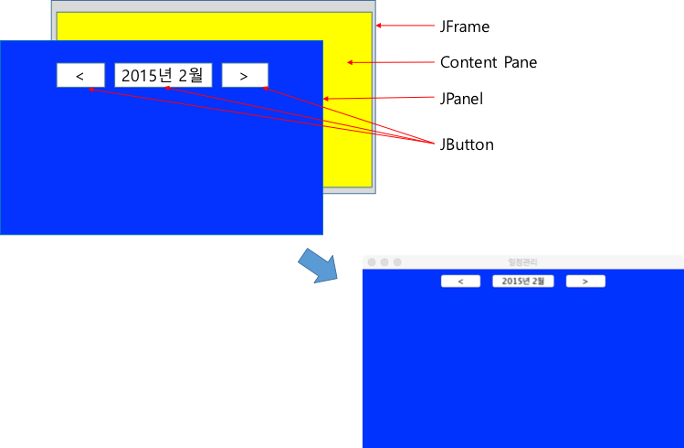
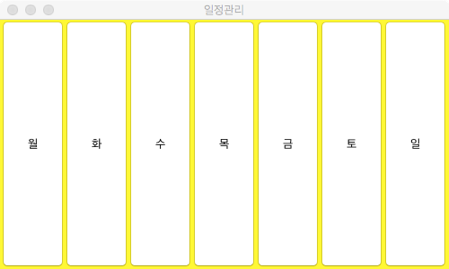
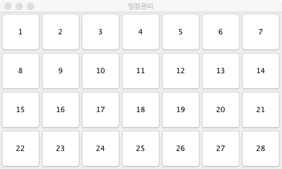
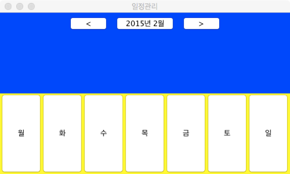
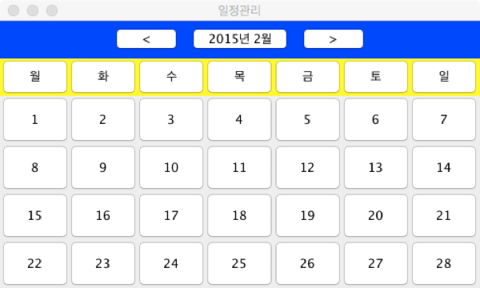

# 자바 GUI 기초 (실습)

	
### 1. FlowLayout 사용
- 아래와 같이 설정된 JPanel 컨테이너를 JFrame의 컨텐츠 팬으로 변경하라.
	- FlowLayout을 배치관리자로 설정한 JPanel 컨테이너 정의
	- JPanel 컨테이너의 배경색을 파란색 (Color.BLUE)으로 설정
	- 다음 그림과 같은 세 개의 JButton을 JPanel 컨테이너에 추가 

	

- [참조 코드] https://github.com/kwanulee/JavaExample/blob/master/JavaGuiBasic/ContePaneChange/src/ContentPaneEx.java

### 2.	GridLayout 사용 1
-  아래와 같이 설정된 JPanel 컨테이너를 JFrame의 컨텐츠 팬으로 변경하라.
	- 1행 7열 GridLayout을 배치관리자로 설정한 JPanel 컨테이너 정의
	- JPanel 컨테이너의 배경색을 노란색 (Color.YELLOW)으로 설정
	- 다음 그림과 같은 7 개의 JButton을 JPanel 컨테이너에 추가 

	

- [참조 코드] https://github.com/kwanulee/JavaExample/blob/master/JavaGuiBasic/GridLayout/src/GridLayoutEx.java

	
### 3. GridLayout 사용2 
- 아래와 같이 설정된 JPanel 컨테이너를 JFrame의 컨텐츠 팬으로 변경하라. 
	-	4행 7열 GridLayout을 배치관리자로 설정한 JPanel 컨테이너 정의
	- 다음 그림과 같은 28 개의 JButton을 JPanel 컨테이너에 추가  

	

- [참조 코드] https://github.com/kwanulee/JavaExample/blob/master/JavaGuiBasic/GridLayout/src/GridLayoutEx.java

	
	
### 4. 기존에 정의된 패널을 이용한 새로운 패널 정의 1
 
- [1](#1), [2](#2)에서 정의한 두 개의 JPanel 컨테이너를 이용하여, 아래와 같이 설정된 JPanel 컨테이너를 JFrame의 컨텐츠 팬으로 변경하라.
	- 2행 1열 GridLayout을 배치관리자로 설정한 JPanel 컨테이너 정의
	- 앞에서 정의한 2 개의 JPanel 컨테이너를 JPanel 컨테이너에 추가
	
	
	
	
### 5. 기존에 정의된 패널을 이용한 새로운 패널 정의 2
- [3](#3), [4](#4)에서 정의한 두 개의 JPanel 컨테이너를 이용하여, 아래와 같이 설정된 JPanel 컨테이너를 JFrame의 컨텐츠 팬으로 변경하라.
	- BorderLayout을 배치관리자로 설정한 JPanel 컨테이너 정의
	- [3](#3), [4](#4)에서 정의한 2 개의 JPanel 컨테이너를 JPanel 컨테이너에 추가
		- [4](#4)에서 정의한 JPanel 컨테이너는 BorderLayout의 BorderLayout.NORTH 위치에 추가하고,  3에서 정의한 JPanel 컨테이너는 BorderLayout의 BorderLayout.CENTER 위치에 추가한다.

- [참조 코드] https://github.com/kwanulee/JavaExample/blob/master/JavaGuiBasic/BorderLayout/src/BorderLayoutEx.java#L22-L27

- [결과 화면]

	
