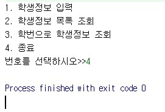
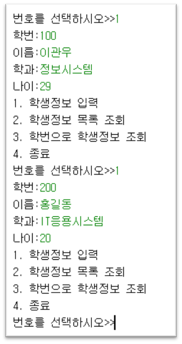
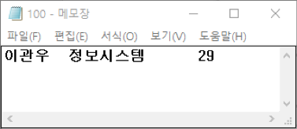
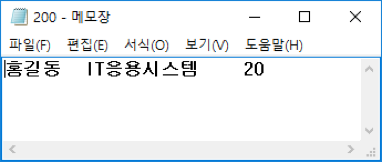
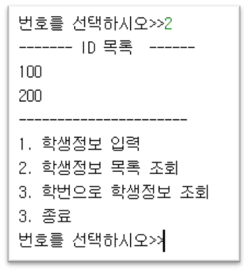
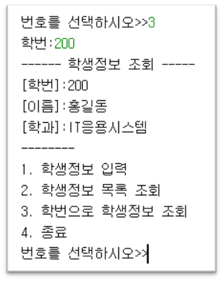

# 입출력 스트림과 파일

### 개요

- 학생의 신상정보를 표준 입력으로부터 받아들여 파일에 저장하고, 파일에 저장된 학생들의 정보를 출력하는 프로그램을 작성한다.
- 프로그램을 시작하면,
	- [1. 학생정보 입력 및 저장]  
	- [2. 학번 목록 출력]  
	- [3. 학번으로 학생정보 조회]
	- [4. 종료]의  메뉴를 보여주고, 사용자가 선택한 기능을 수행한 후 다시 메뉴를 보여준다. (단, 4.종료를 선택하면 프로그램을 종료한다.)

		

### 1. 학생정보 입력 및 저장

- 키보드로부터 학생의 학번, 이름, 학과, 나이를 입력 받고, 학번과 동일한 이름의 파일에 이름, 학과, 나이 정보를 저장한다.

	
	
	
	
	
참고자료: https://github.com/kwanulee/JavaExample/blob/master/IOStream/BufferedReaderEx/src/BufferedReaderEx.java

### 2.	학번 목록 출력
- 저장된 학번 목록을 출력하기 위해, 학번과 동일한 이름으로 만들어진 모든 파일 이름을 얻어 출력한다.

	

참고자료: https://github.com/kwanulee/JavaExample/blob/master/IOStream/FileClassExample/src/FileClassExample.java#L4-L15
 

### 3.	학번으로 학생정보 조회
- 조회할 학생의 학번을 입력하면, 해당되는 학번과 동일한 이름의 파일로부터 데이터를 읽어 화면에 출력한다.

	
	
참고자료: https://github.com/kwanulee/JavaExample/blob/master/IOStream/TokenExtraction/src/TokenTest.java