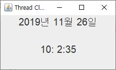
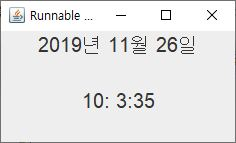

# 자바 스레드

<a name="1"></a>
### 1. THREAD 클래스로 디지털 시계 만들기

- 현재 날짜와 시간을 표시하는 디지털 시계를 Thread 클래스를 이용하여 만들어라. 시계는 년, 월, 일, 시, 분, 초 값을 가진다.

	
	
- 현재 시간 값을 알아오는 코드는 다음과 같다.
	- Calendar 클래스를 사용하려면 **import java.util.Calendar;** 문이 필요하다.

	```java
	Calendar c = Calendar.getInstance();
	int year = c.get(Calendar.YEAR);
	int month = c.get(Calendar.MONTH);
	int day = c.get(Calendar.DAY_OF_MONTH);
	int hour = c.get(Calendar.HOUR_OF_DAY);
	int min = c.get(Calendar.MINUTE);
	int second = c.get(Calendar.SECOND);

	String dayText = String.format("%4d년 %2d 월 %2d 일",year,month+1,day);
	String clockText = String.format("%2d:%2d:%2d", hour, min, second);
	```

참고자료: https://github.com/kwanulee/JavaExample/blob/master/JavaThread/ThreadTimerEx/src/ThreadTimerEx.java

<a name="2"></a>
### 2.	RUNNABLE 인터페이스로 디지털 시계 만들기
- 현재 날짜와 시간을 표시하는 디지털 시계를 Runnable 인터페이스를 이용하여 만들어라. 시계는 년, 월, 일, 시, 분, 초 값을 가진다.
실행 결과는 프레임의 타이틀을 제외하고는 1번과 동일한다.

	

[참조코드]
	https://github.com/kwanulee/JavaExample/blob/master/JavaThread/RunnableTimerEx/src/RunnableTimerEx.java

<a name="3"></a>
### 3.	마우스 클릭으로 디지털 시계 중지와 재시작
- 디지털 시계의 화면 (컨텐트 팬)을 마우스로 클릭하면, 시계의 동작을 중지하고, 중지된 상태의 디지털 시계의 화면을 다시 마우스로 클릭하면, 시계의 동작을 재시작한다.

[참조코드]
https://github.com/kwanulee/JavaExample/blob/master/JavaThread/VibratingFrame/src/VibratingFrame.java#L15-L20
