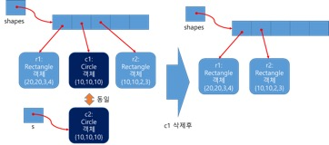

# 다형성의 활용 (실습)

지난주 실습과제 클래스 상속에서 정의한 Shape, Rectangle, Circle 클래스를 바탕으로 다음의 내용을 구현해 보자.

<a name="1"></a>
### 1. 추상 클래스 (실습)

1. **Shape** 클래스의 아래와 같이 수정하시오.
	- **Shape** 클래스의 멤버 변수 **x,y**를 **protected**로 선언한다.
	- **Shape** 클래스에 **public boolean equals(Shape s)** 라는 추상 메소드를 정의한다.

2. **Rectangle** 클래스와 **Circle** 클래스에서 **Shape** 클래스에서 정의된 **public boolean equals(Shape s)**를 재정의한다.
	- **Rectangle** 클래스의 **public boolean equals(Shape s)**:
		-	파라미터로 입력된 Shape 객체 s가 Rectangle 타입의 객체인지 판별 (instanceof 연산자 이용)
		- Shape 객체 s가 Rectangle 타입의 객체인 경우, 객체변수 s를 Rectangle 타입으로 다운캐스팅하여, 객체변수 s로 참조될 수 있는 Rectangle 타입의 모든 멤버변수 (x, y, width, height)의 값이 현재 Rectangle 객체의 멤버 변수의 값과 동일하면 true를 반환, 그렇지 않으면 false를 반환
	- Circle 클래스의 **public boolean equals(Shape s)**:
		- 앞의 Rectangle 클래스의 equals() 메소드 구현과 같은 방식

- 1과 2번을 테스트 하기 위한 코드는 다음과 같다.

	```java
	public class 실습7_1 {
	    public static void main(String[] args) {
	        Rectangle r1 = new Rectangle(10, 10, 100, 100);
	        Rectangle r2 = new Rectangle(0, 10, 100, 100);
	        Rectangle r3 = new Rectangle(10, 10, 10, 100);
	        Rectangle r4 = new Rectangle(10, 10, 100, 100);
	        r1.display();
	        r2.display();
	        System.out.println("두 Rectangle 객체는 동일한가? " + r1.equals(r2));
	        System.out.println();

	        r3.display();
	        r4.display();
	        System.out.println("두 Rectangle 객체는 동일한가? " + r3.equals(r4));
	        System.out.println();

	        r1.display();
	        r4.display();
	        System.out.println("두 Rectangle 객체는 동일한가? " + r1.equals(r4));
	        System.out.println();

	        Circle c1 =  new Circle(20,30,100);
	        Circle c2 =  new Circle(10,30,10);
	        Circle c3 =  new Circle(20,30,100);

	        c1.display();
	        c2.display();
	        System.out.println("두 Circle 객체는 동일한가?"+c1.equals(c2));
	        System.out.println();

	        c1.display();
	        c3.display();
	        System.out.println("두 Circle 객체는 동일한가?"+c1.equals(c3));
	        System.out.println();

	        r1.display();
	        c1.display();
	        System.out.println("Rectangle 객체와 Circle 객체는 동일한가?"+r1.equals(c1));
	        System.out.println("Circle 객체와 Rectangle 객체는 동일한가?"+c1.equals(r1));
	    }
	}

	```

- 실행결과

	```
	[Rectangle 객체]x=10, y=10, width=100, height=100
	[Rectangle 객체]x=0, y=10, width=100, height=100
	두 Rectangle 객체는 동일한가? false

	[Rectangle 객체]x=10, y=10, width=10, height=100
	[Rectangle 객체]x=10, y=10, width=100, height=100
	두 Rectangle 객체는 동일한가? false

	[Rectangle 객체]x=10, y=10, width=100, height=100
	[Rectangle 객체]x=10, y=10, width=100, height=100
	두 Rectangle 객체는 동일한가? true

	[Circle 객체]x=20, y=30, radius=100
	[Circle 객체]x=10, y=30, radius=10
	두 Circle 객체는 동일한가?false

	[Circle 객체]x=20, y=30, radius=100
	[Circle 객체]x=20, y=30, radius=100
	두 Circle 객체는 동일한가?true

	[Rectangle 객체]x=10, y=10, width=100, height=100
	[Circle 객체]x=20, y=30, radius=100
	Rectangle 객체와 Circle 객체는 동일한가?false
	Circle 객체와 Rectangle 객체는 동일한가?false

	```

---
<a name="2"></a>
### 2. 다형성 (실습)

- 다음의 멤버를 가지는 **ShapePanel** 클래스를 정의하라.
	- Shape 객체 배열 변수 (private): Shape 타입 객체 (Rectangle 객체 혹은 Circle 객체)를 저장하는 배열
	- int 타입의 변수 (private): Shape 객체 배열에 저장된 객체의 수를 나타냄.
	- 생성자: 멤버 변수 값을 초기화함.
	- Shape 객체 배열 생성 (배열의 크기는 임의로 설정)
	- int 타입의 변수 초기화
	- public void add(Shape s)
	- public void delete(Shape s)
	- public void display()

- add() 메소드 구현
	- **public void add(Shape s)**
		- 파라미터로 입력된 Shape 객체 s를 멤버 변수로 선언된 Shape 객체 배열에 저장
		- 파라미터로 입력된 Shape 객체 s와 동일한 도형이 이미 Shape 객체 배열에 있으면(1번 실습문제의 equals() 메소드 이용) 추가하지 않음

- delete() 메소드 구현
	- **public void delete(Shape s)**
		- 파라미터로 입력된 Shape 객체 s와 동일한 객체가 있으면(1번 실습문제의 equals() 메소드 이용), 이를 Shape 객체 배열에서 삭제;
		- Shape 객체 배열의 중간에서 Shape 객체가 삭제된 경우에, 객체 배열 중간에 빈 공간이 없도록 삭제된 위치 바로 다음부터 Shape 객체 배열의 내용을 앞으로 이동.
		- Shape 객체 배열에 저장된 객체의 수 하나 감소시킴

			
			
- display() 메소드 구현
	- **public void display()**
		- Shape 배열에서 저장된 모든 도형 객체를 화면에 출력
			- 각 도형이 가지고 있는 정보를 출력

- 구현한 **ShapePanel** 클래스를 테스트 하기 위한 코드는 다음과 같다.

	```java
	public class 실습7_2 {
	    public static void main(String[] args) {
	        ShapePanel panel = new ShapePanel();

	        panel.add(new Rectangle(20,20,3,4));
	        panel.add(new Circle(10,10,10));
	        panel.display();

	        panel.add(new Rectangle(10,10,2,3));  // Rectangle 객체 추가
	        panel.add(new Rectangle(20,20,3,4));  // 이미 배열에 추가된 것과 동일하므로, 추가 안함
	        panel.display();

	        panel.add(new Circle(100,100,2));     // Circle 객체 추가
			panel.add(new Circle(10,10,10));      // 이미 배열에 추가된 것과 동일하므로, 추가 안함
	        panel.delete(new Circle(10,10,10));   // Circle 객체 삭제
	        panel.display();
	    }
	}

	```

- 실행결과

	```
	********** ShapePanel에 등록된 모든 도형 **********
	[Rectangle 객체]x=20, y=20, width=3, height=4
	[Circle 객체]x=10, y=10, radius=10
	********** ShapePanel에 등록된 모든 도형 **********
	[Rectangle 객체]x=20, y=20, width=3, height=4
	[Circle 객체]x=10, y=10, radius=10
	[Rectangle 객체]x=10, y=10, width=2, height=3
	********** ShapePanel에 등록된 모든 도형 **********
	[Rectangle 객체]x=20, y=20, width=3, height=4
	[Rectangle 객체]x=10, y=10, width=2, height=3
	[Circle 객체]x=100, y=100, radius=2
	```
