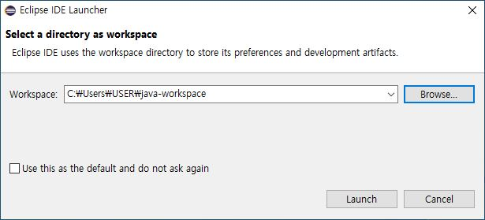
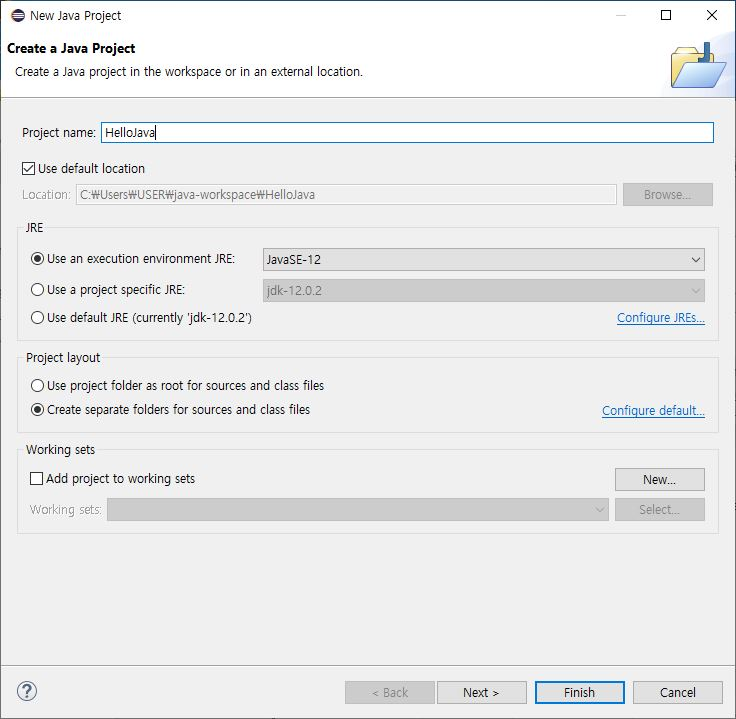
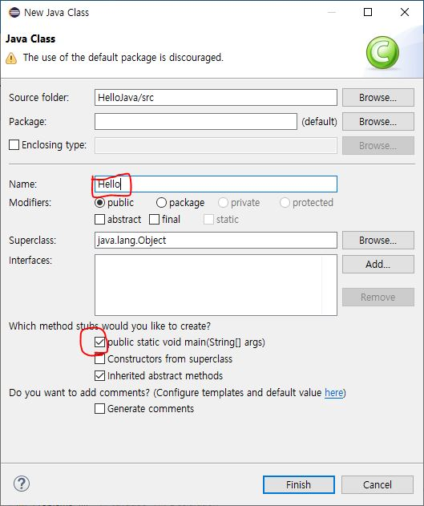
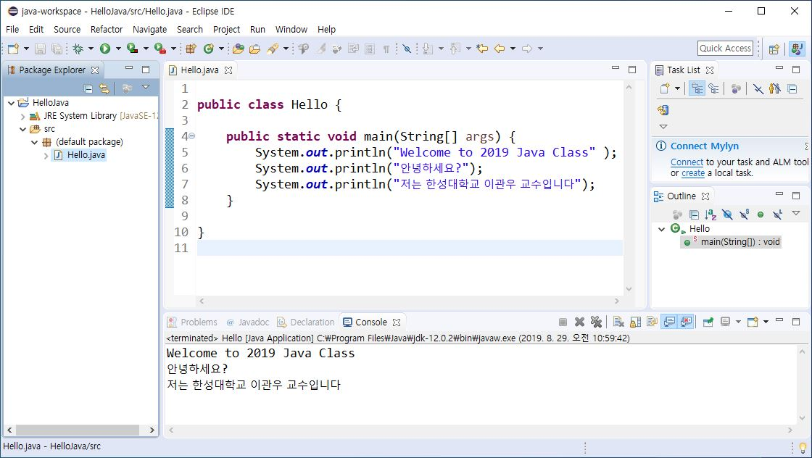
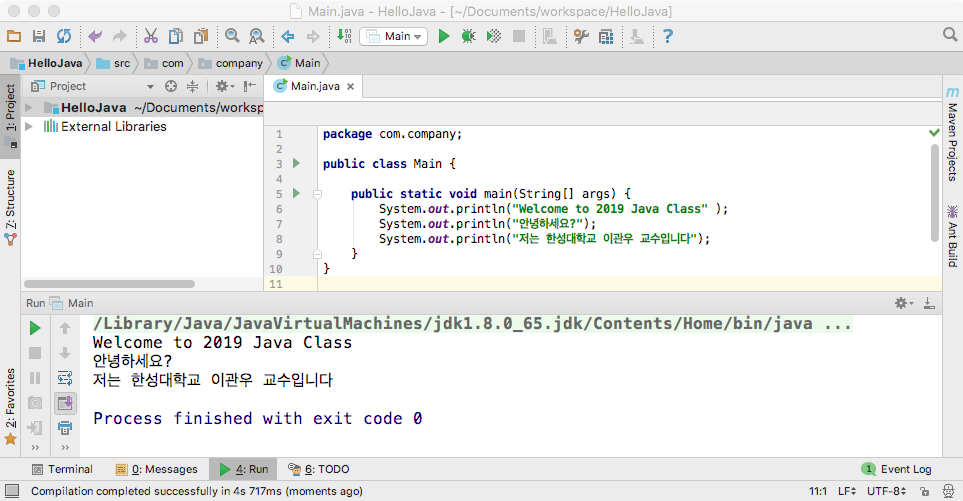

# 자바 프로그램 작성 및 실행 (실습)

## 1.	Java 개발환경 설치
###1.1.	JDK 다운로드 및 설치
1.	아래 링크를 통해서 접속

	http://www.oracle.com/technetwork/java/javase/downloads/index-jsp-138363.html

2. **Java DOWNLOAD** 클릭후 다음하면에서, [**Accept License Agreement**] 선택하고, 자신의 컴퓨터에 맞는 파일을 선택하여 다운로드
	- 가령, Windows 컴퓨터인 경우, Windows 운영체제가 32비트이면 Window x86을 64비트이면 Windows x64를 선택해야 함

	
	
3. 다운로드한 파일 실행하여 설치

---
###1.2. 통합개발환경 (IDE) 다운로드 및 설치
- Java IDE로 사용되는 대표적인 소프트웨어는 **Eclipse**와 **IntelliJ IDEA**가 있습니다.

### 1.2.1 Eclipse IDE 설치
1. 아래 링크를 통해서 접속
	https://www.eclipse.org/downloads/
2. **Community** 버전 다운로드
3. 다운로드한 파일 실행하여 설치


### 1.2.2 IntelliJ IDEA IDE 설치
1. 아래 링크를 통해서 접속
	https://www.jetbrains.com/idea/?fromMenu
2. **Download** 버튼을 클릭하여 설치 프로그램(예, elipse-inst-win64.exe) 다운로드
3. 다운로드한 설치 프로그램을 실행하여 설치
	- 	**Elipse IDE for java Developers**을 선택하여 설치

---
## 2. Elipse IDE를 이용한 자바프로그램 개발
이클립스 프로그램을 실행한 후, 다음 단계를 차례로 진행한다.

### 단계1: 작업공간 설정
- 작업 공간 폴더 (디렉토리)를 지정 후, **Launch** 버튼 클릭
	- Workspace (작업공간)은 자바 프로그램 프로젝트를 저장하는 폴더로서 사용자가 자신의 작업 공간을 지정할 수 있습니다.
	
	
	
### 단계2: 프로젝트 생성
1. **File - New - Java Project** 메뉴 선택
2. **Project name**에 프로젝트 이름(예, HelloJava)을 입력하고 **Finish**버튼 클릭

	

### 단계3: 모듈 정보 생성 (생략)
- 다이얼로그 창에서 **Don't Create** 버튼 클릭

### 단계4: 클래스 생성
1.  **File - New - Class** 메뉴 선택
2. **Name**에 생성할 클래스 이름을 입력하고, **public static void main(String[] args)** 체크박스를 선택 후, **Finish**버튼 클릭

	

### 단계5: 자바 소스 작성
- 자바 소스 코드 작성

	```java	
	public class Hello {
	
	    public static void main(String[] args) {
	        System.out.println("Welcome to 2019 Java Class" );
	        System.out.println("안녕하세요?");
	        System.out.println("저는 한성대학교 이관우 교수입니다");
	    }
	}
	
	```
	
### 단계6: 실행

- **Run**>**Run** 메뉴 선택 혹은 연두색의 아이콘() 클릭하여 실행결과를 아래 Console참에서 확인

	
		
---
## 3. IntelliJ IDEA IDE를 이용한 자바 프로그램 개발
### 단계1: 프로젝트 생성
1. **Create New Project** 메뉴 선택

	
	
2. **Project SDK**의 드롭다운 메뉴에서 설치된 버전의 Java SDK를 선택 후, **Next** 버튼 클릭
	- Java SDK가 안보이는 경우에는 New 버튼을 누른 후, 설치된 Java SDK 폴더를 선택 후, OK 버튼 클릭

	
3. **Create project from template** 체크 후에, **Command Line App** 선택하고 **Next** 버튼 클릭

4. **Project name** 칸에 프로젝트 이름(예, *HelloJava*)을 입력하고 **Project location**에 프로젝트를 폴더 위치를 지정 후에, **Finish** 버튼 클릭

### 단계2: 자바 소스 작성 및 실행
1. 자바 소스 코드 작성

	```java
	package com.company;
	
	public class Main {
	
	    public static void main(String[] args) {
	        System.out.println("Welcome to 2019 Java Class" );
	        System.out.println("안녕하세요?");
	        System.out.println("저는 한성대학교 이관우 교수입니다");
	    }
	}
	
	```
2. 컴파일 및 실행
	- **Run**>**Run 'Main'** 메뉴 선택 혹은 연두색의 아이콘() 클릭

	
	
---
##4. Java 프로그램 실습
1. 새로운 Java 프로젝트를 생성한다.
2. 화면에 자신의 이름, 나이, 학교 등의 정보를 출력하는 자바 프로그램을 작성해 보자.
3. 작성된 자바 프로그램을 컴파일하고 실행하여 실행결과를 확인해 본다.
