# 스윙 컴포넌트 활용 (실습)

### 0. 시작하기
- 아래와 같은 화면을 디자인 한다.

	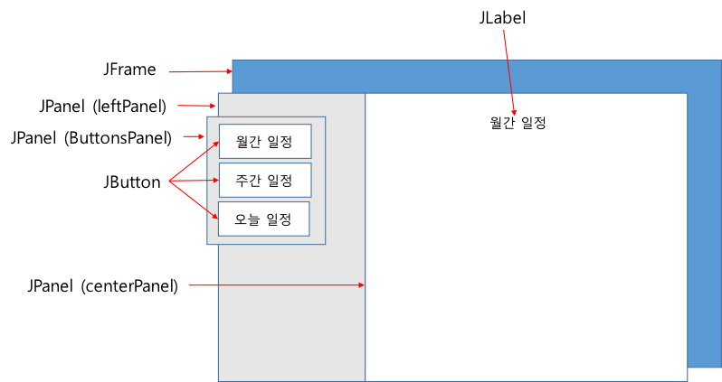
	- CenterPanel (JPanel)
		- 배경색은 Color.WHITE로 설정
		- JLabel 컴포넌트를 하나 포함한다. (초기 문자열을 “월간 일정”
	- ButtonsPanel (JPanel)
		- GridLayout 배치관리자 (3행 1열)로 설정한다.
		- 3개의 JButton 컴포넌트를 포함한다.
	- leftPanel (JPanel)
		- ButtonsPanel을 자식으로 포함한다.
	- 각 JButton에 다음의 기능을 수행하는 ActionListener를 연결시킨다.
		- JButton이 눌러질때마다, 해당 버튼의 문자열을 CenterPanel에 포함된 JLabel에 표시
			- 해당 버튼의 문자열을 얻는 방법: ActionEvent의 getActionCommand() 메소드 활용
			- JLabel의 컨텐츠 변경 방법: JLabel의 setText(String) 메소드 활용

- 실행결과
	- 초기 화면
	
		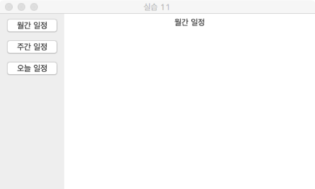
		
	- [주간 일정] 버튼이 눌러진 경우

		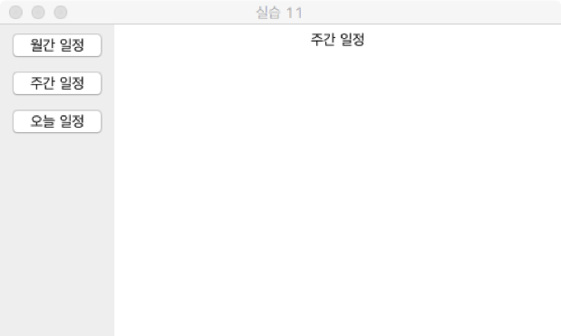
		
	- [주간 일정] 버튼이 눌러진 경우

		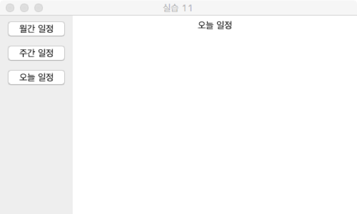

### 1. JRadioButton 활용
- ButtonsPanel (JPanel) 을 대체할 수 있는 RadioButtonsPanel을 정의하고, RadioButtonsPanel을 leftPanel의 자식으로 포함하라.
- RadioButtonsPanel은 다음과 같이 정의된다.
	- GridLayout 배치관리자 (3행 1열)로 설정한다.
	- 3개의 JRadioButton 컴포넌트를 포함한다.
	- 3개의 JRadioButton은 그룹으로 묶여서, 이들 중 하나만 선택될 수 있도록 한다.
- JRadioButton이 선택되면 해당되는 버튼의 문자열이 CenterPanel에 포함된 JLabel에 표시되어야 한다.
- 실행 결과 ([주간 일정] 라디오버튼이 선택된 경우)

	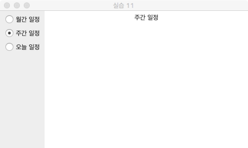

- [참조 코드] https://github.com/kwanulee/JavaExample/blob/master/SwingComponent/RadioButtonEx/src/RadioButtonEx.java

### 2. JComboBox 활용
- ButtonsPanel (JPanel) 을 대체할 수 있는 ComboBoxPanel을 정의하고, ComboBoxPanel을 leftPanel의 자식으로 포함하라.
- ComboBoxPanel은 다음과 같이 정의된다.
	- 3개의 아이템(월간 일정, 주간 일정, 오늘 일정)을 가진 JComboBox 컴포넌트를 포함한다.
- JComboBox의 아이템이 선택되면 해당되는 아이템의 문자열이 CenterPanel에 포함된 JLabel에 표시되어야 한다.
- 실행 결과 ([오늘 일정] 아이템이 선택된 경우)

	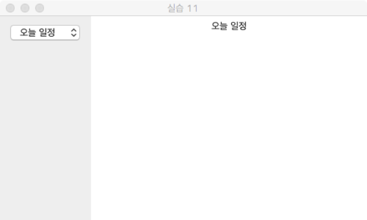

- [참조 코드] https://github.com/kwanulee/JavaExample/blob/master/SwingComponent/ComboBoxEx/src/ComboBoxEx.java

### 3. 메뉴 생성
- 프레임에 아래 화면과 같이 메뉴바에 메뉴(Options)을 붙이고, 메뉴에 메뉴아이템을 추가하시오.
	- Options (메뉴): Buttons (메뉴아이템), RadioButtons (메뉴아이템), ComboBox (메뉴아이템)
- 실행결과
 

	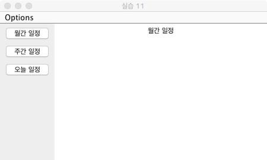
	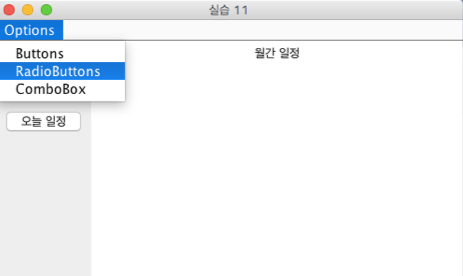

- [참조 코드] https://github.com/kwanulee/JavaExample/blob/master/SwingComponent/MenuEx/src/MenuEx.java

### 4. 메뉴아이템에 ActionListener 등록
- Options 메뉴의 Buttons, RadioButtons, ComboBox 메뉴아이템 선택에 따라 실행 시에 leftPanel에 이미 추가된 패널을 지우고, ButtonPanel, RadioButtonPanel, ComboBoxPanel 중에 선택된 것을 leftPanel에 추가하여 아래 실행결과 처럼 동작하도록 하시오
- 힌트
	- leftPanel에 이미 추가된 패널을 지우는 방법은 removeAll() 메소드 활용
	- leftPanel에 다른 패널을 추가하는 방법은 add() 메소드를 사용하면 되나, 반드시 revalidate() 메소드를 이어서 호출해주어야 변경 내용이 반영된다
- 실행 결과
	- 초기화면
	
		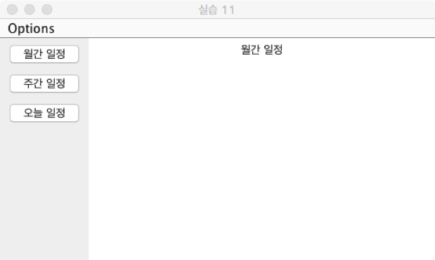
	- Options 메뉴의 RadioButton 메뉴아이템 선택 후

		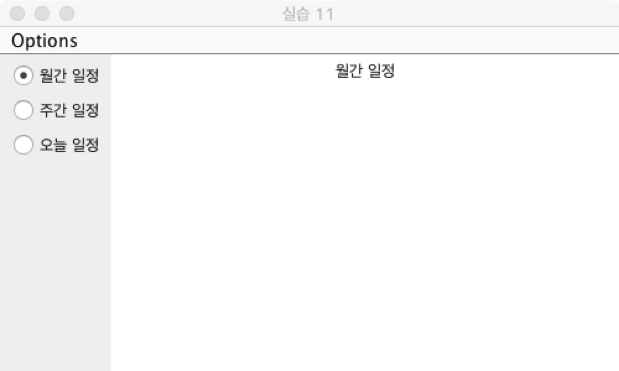
	- Options 메뉴의 ComboBox메뉴아이템 선택 후

		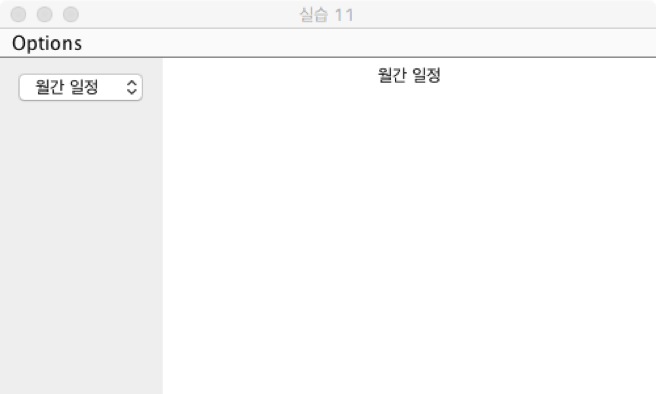
		